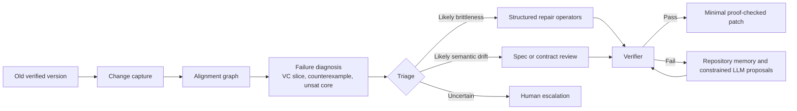

# Refactoring-Stable Proof Repair in Verifiable Software

## Executive summary

The uploaded revision is already a strong thesis blueprint. Its core idea is crisp: proof maintenance should be treated as *semantic repair over nearby program versions*, not as proof synthesis from scratch. It fixes one primary ecosystem, stages the work into three publishable units, defines a Month-1 ecosystem gate, names concrete datasets and baselines, and specifies success metrics and a 24‑month execution plan. In the uploaded plan, the backbone is: **P1** a Dafny refactoring-brittleness benchmark and empirical study, **P2** structured symbolic repair over aligned old/new artefacts, and **P3** a narrow hybrid LLM-symbolic extension with brittleness-versus-drift triage. fileciteturn0file0

That framing is unusually well aligned with the best recent maintenance-oriented literature. The closest antecedent, **Sisyphus**, showed that old proofs and old invariants can be reused to repair evolved verified libraries through dynamic alignment, invariant synthesis, and proof-driven testing, rather than discarding prior proof structure. Follow-on work extended proof repair to broader representational changes via quotient/setoid equivalences. At the same time, a separate line of work has shown that proof failures in verifier-based systems are often not just “lack of proof” but *maintenance failures*: debugging friction, SMT instability, and tool-version compatibility can all break previously working proofs in systematic ways. citeturn34view0turn31view5turn30view6turn35view4turn30view10

The largest gap in the literature is not another system that proves from scratch, nor another generic LLM verifier. The gap is a *maintenance-centred* stack for auto-active verification: a benchmark of refactoring-induced breakage, an alignment-rich source-level repair engine, and a sound triage mechanism that distinguishes benign proof brittleness from actual semantic drift. Recent high-profile papers have advanced specification generation, invariant synthesis, theorem-proving environments, and helper-assertion generation, but they predominantly target generation or proving tasks rather than repository-local, version-to-version proof maintenance. citeturn31view1turn32view2turn32view3turn33view0turn32view0turn32view1turn31view3turn31view4

My main recommendation is therefore to **keep the user’s three-stage spine**, but strengthen it for top-tier publication by expanding the benchmark axis, making the symbolic repair engine more VC-aware, and turning the drift/triage problem into a first-class research contribution rather than a thin classifier add-on. Of the new proposals below, the best *thesis core* is **RefactorBench++**, **AxiomLens**, and **DriftGuard**. **RepoMemoryRepair** is the highest-upside stretch proposal if adequate compute and real-history data exist. **ProofPulse IDE** is valuable if the project wants a stronger software-engineering and human-factors arc. This recommendation assumes that domain, modality, and compute budget remain unspecified, so I assume a Dafny-first setting, one doctoral researcher, modest annotation support, and either a moderate API budget or access to one modern GPU. fileciteturn0file0

## Proposal dissection

The revision already encodes several academically sound choices. It constrains the ecosystem to **Dafny**, with an explicit fallback to **Verus** if a one-month pilot cannot find enough reproducible real-history pairs or if verification cost is too high. It also insists on proof-checked validation, reproducible artefacts, and licence-aware mining. Those are exactly the right boundary conditions for a top-tier programme in this area. fileciteturn0file0

Substantively, the proposal contains six central themes. First, it treats maintenance as a *nearby-version* problem. Second, it focuses on *auto-active verification* rather than fully interactive theorem proving. Third, it builds a sequential dependency chain: benchmark first, symbolic repair second, hybrid triage third. Fourth, it insists that every claim be validated by the verifier rather than by tests alone. Fifth, it explicitly separates *syntactic transfer*, *symbolic repair*, and *LLM-only repair* as baselines. Sixth, it frames publishability and thesis survivability as design constraints, which is strategically sensible for doctoral work. fileciteturn0file0

The operational plan extracted from the uploaded revision is as follows. **P1** creates a Dafny refactoring engine and **Dataset A**, sized at roughly **250–500 verified seed programs multiplied by applicable refactorings**, then evaluates three baselines: re-verification, syntactic transfer, and a fully specified LLM-only repair baseline. **P2** introduces an alignment engine over functions, loops, assertions, contracts, and helper lemmas, uses a small operator calculus and best-first search, and evaluates on Dataset A using automatic repair rate, candidate budget, repair time, alignment precision/recall, and patch-size metrics. **P3** adds a narrow LLM stage downstream of symbolic search, introduces **Dataset B** of roughly **50–120 mined real-history pairs** and **Dataset C** of about **60–100 double-labelled brittleness/drift cases**, and measures end-to-end repair, triage quality, transfer to real history, and a soundness audit. The proposal also defines explicit success thresholds, including non-trivial breakage in P1, a meaningful advantage for symbolic repair in P2, and both repair-rate and triage-quality improvements in P3. fileciteturn0file0

The most important caveat is that the uploaded copy available to me contains abbreviated lines in a few places. I can see the *existence* of the fixed seven-refactoring scope in P1, the “five operators” commitment in P2, and the triage/classifier plan in P3, but not every elided sub-item in full. I therefore treat the proposal’s high-level structure, dataset sizes, baselines, metrics, and timeline as authoritative, while treating the exact inventory of P2 operators and some deliverable wording as partially specified rather than fully frozen. fileciteturn0file0

## Related work from recent top-tier literature

### Proof repair and proof maintenance

The closest direct predecessor is **Mostly Automated Proof Repair for Verified Libraries**. That paper is important because it moves proof maintenance away from “prove again from scratch” and towards *repair by reuse*: it aligns old and new programs, synthesises candidate invariants, prunes them with proof-driven testing, and uses prior proof structure as an asset rather than a nuisance. In evaluation, the authors report repairing proofs for all ten real-library functions they study, and across their full 14-program benchmark they can construct repaired proofs with only small residual obligations. That is the strongest evidence in the literature for the proposal’s central philosophical move. citeturn34view0turn36view2turn36view4turn36view5

**Proof Repair across Quotient Type Equivalences** extends that agenda by showing that repair can cover broader behavioural-preserving changes than simple type-equivalence rewriting. It explicitly starts from the observation that proofs in systems such as Rocq/Coq are brittle, and extends automated repair to quotient/setoid equivalences and associated behaviour changes. The implication for the user’s proposal is important: maintenance-aware proof repair is viable, but most current algorithms are still formulated over interactive-proof objects, not over source-level annotations and SMT-backed proof hints in auto-active verifiers. citeturn31view5

A complementary empirical result appears in **Why the Proof Fails in Different Versions of Theorem Provers**, which studies proof-assistant upgrades rather than source refactorings. The paper collects **12,079 compatibility issues** from more than **21,000 Isabelle theories** across four releases and derives a taxonomy of issue types, root causes, and fix strategies. This is not a Dafny paper, but it strongly supports the proposal’s broader thesis that proof maintenance is a systematic, measurable engineering problem rather than a collection of anecdotes. It also suggests a missed opportunity in the uploaded revision: version migration and environment drift could become a benchmark axis alongside source refactoring. citeturn35view5turn30view10

### Instability, debugging, and compatibility

A second cluster of papers shows why source-level repair cannot rely on “verification failed” as a sufficient diagnostic. **Mariposa** quantified SMT instability in automated program verification and found that the most recent solver version was unstable on **2.6%** of the queries it studied, with some projects reaching **5.0%**. That is already enough to poison a maintenance pipeline if the system cannot distinguish semantic problems from solver/pathology problems. citeturn35view4

That diagnosis is sharpened by **Context Pruning for More Robust SMT-based Program Verification**. The core finding is that program-verification queries typically contain large amounts of irrelevant context: unsat cores retain only a tiny slice of assertions, and irrelevant assertions account for **78%** of observed unstable instances in the study. SHAKE then exploits that observation and reports instability reductions of **29% on Z3** and **41% on cvc5**. For the user’s proposal, this is compelling evidence that a repair engine should not just search over source edits; it should also reason about *axiom relevance*, *VC slicing*, and *query normalisation*. citeturn35view1turn35view2

**Cazamariposas** then takes the next maintenance step: not merely mitigating instability in advance, but *debugging individual unstable failures*. Its differential analysis identifies problematic quantified formulas and suggests stabilising fixes; on one benchmark subset it has a **36%** chance of finding a stabilising edit in one shot. This is directly relevant to the P3 triage idea in the uploaded plan. A good repair system in Dafny should not merely emit candidate assertions; it should know when the “repair” is actually to simplify or stabilise the proof context. citeturn35view3turn35view0

The source-level debugging angle is captured best by **ProofPlumber**. The paper introduces *proof actions* that transform source-level artefacts rather than low-level prover state, and it demonstrates that many routine proof-debugging practices can be automated: the framework implements **17 proof actions**, including ones inspired by Dafny’s manual rewrite advice. This is one of the most actionable insights for the user’s proposal, because it suggests a design pattern for a Dafny repair calculus: small, transparent, source-level transformations that align with proof engineers’ existing debugging habits. citeturn33view5turn33view4

Finally, usability evidence matters. **On the Impact of Formal Verification on Software Development** interviews **14 experienced Dafny users** and concludes that, despite automation, these tools still impose substantial practical effort and usability burdens. That result supports the proposal’s motivation, but it also points to an evaluation gap: the thesis should measure *developer-facing repair cost*, not just pass/fail verification outcomes. citeturn11search0turn11search4

### Specification generation, invariant synthesis, and proof automation

A large recent literature has focused on generating the *missing ingredients* for verification. **LEMUR** formalises a sound calculus that combines LLMs with automated reasoners for program verification. **AutoSpec** reports that iterative specification synthesis, backed by static analysis and verification feedback, can successfully verify **79%** of programs in its evaluation. **SpecGen** reports generating verifiable specifications for **279 of 385 programs**, outperforming both purely LLM-based approaches and classic tools such as Houdini and Daikon. These are strong papers, but they mainly attack specification generation and invariant inference in partially specified programs, not maintenance under source evolution. citeturn32view3turn31view1turn32view2turn32view4

The invariant-synthesis benchmark literature reinforces that point. The **LIG‑MM** benchmark broadened invariant generation to memory-manipulating programs, exposing a major difficulty spike beyond numerical examples. **ClassInvGen** showed that LLM-based co-generation of class invariants and test inputs can beat pure LLM and Daikon-style baselines for executable class invariants. But **InvBench** then delivered an important corrective: even with improved evaluation and decision procedures, current LLM-based invariant synthesis remains an open challenge rather than a solved engineering component. That is why the uploaded proposal is right to keep symbolic repair central and to use LLMs narrowly rather than as unrestricted patch generators. citeturn19search1turn19search5turn19search6

Dafny-specific work is now emerging quickly. **DafnyBench** provides a benchmark with **more than 750 Dafny programs** and roughly **53,000 lines of code**. **Laurel** shows that repository-conditioned LLM prompting can generate **over 50%** of required helper assertions from three real-world Dafny codebases. **dafny-annotator** reports that fine-tuning improves LLaMa‑8B to **50.6%** success. **Specification-Guided Repair of Arithmetic Errors in Dafny Programs using LLMs** reports **89.6% fault localisation coverage** and a best repair rate of **74.18%** on arithmetic bugs. Collectively, these papers prove that Dafny is now a live experimental ecosystem for AI-assisted verification. But they still leave the proposal’s core gap largely untouched: there is no principled, maintenance-centric benchmark-and-repair stack for *refactoring-induced breakage and real-history proof drift*. citeturn33view2turn33view3turn33view0turn33view1turn32view7turn32view6

### Open theorem-proving and software-verification benchmarks

The theorem-proving community has also made rapid progress in tooling and open corpora. **LeanDojo** lowers access barriers with open data, models, toolkits, and a benchmark of **98,734 theorems and proofs**. **Selene** provides a project-level proof-generation benchmark grounded in the industrial-scale seL4 proof effort. **FVEL** builds an Isabelle-based verification environment with a large proof-process corpus, and **NTP4VC** introduces what it calls the first real-world multi-language benchmark for theorem proving over verification conditions. These are major infrastructural advances. Their common limitation, relative to the user’s proposal, is that they emphasise theorem proving *within* a fixed project state rather than proof maintenance *across* neighbouring project states. citeturn32view0turn32view1turn31view3turn31view4

## Gaps, limitations, and design principles

The literature suggests five concrete gaps.

First, there is still no benchmark that makes **maintenance** the primary task for auto-active verification. Existing datasets and systems are strong on proof generation, specification generation, invariant synthesis, and proof automation, but weak on controlled refactoring, real-history code drift, and repository-local breakage. That makes the benchmark component of the uploaded proposal not just useful but strategically differentiating. citeturn33view2turn31view1turn32view2turn32view1turn31view4

Second, the field lacks a robust **alignment layer** between old and new source artefacts. Sisyphus shows that alignment matters, and ProofPlumber shows that source-level structural operations are feasible, but the literature does not yet offer a mature alignment formalism for auto-active systems that maps functions, loops, helper lemmas, assertions, ghost state, and VC fragments across change. The uploaded plan is correct to make alignment a thesis-level contribution rather than an implementation detail. citeturn34view0turn33view5

Third, there is underuse of **verifier internals** as repair signals. The instability papers show that query relevance, problematic quantifiers, and solver pathologies carry actionable information, yet most LLM-assisted systems still condition mainly on source text, error strings, and coarse verifier feedback. A top-tier repair system should be *VC-aware*, *unsat-core-aware*, and *counterexample-aware*. citeturn35view1turn35view2turn35view3

Fourth, the literature has not adequately separated **proof brittleness** from **semantic drift**. This is arguably the most important scientific gap. A system that “repairs” a broken proof by weakening specifications or inserting irrelevant hints can pass the verifier while silently changing the intended meaning of the program. The uploaded plan’s soundness audit and drift gate are therefore not auxiliary quality checks; they are research contributions in their own right. citeturn31view4turn32view6turn11search4

Fifth, evaluation remains too focused on pass rates and too weak on **developer cost, future stability, and maintainability**. The OOPSLA user study, the proof-action framework, and the compatibility study all suggest that long-term adoption depends on how transparent, local, reproducible, and debuggable repairs are. A top-tier version of this thesis should therefore report not only repair success, but also candidate counts, patch size, re-breakage under solver-version changes, and human time-to-resolution on a stratified sample. citeturn11search4turn33view5turn35view5

The design principle I would therefore use for the whole programme is the following: **repair locally, validate globally, and abstain when semantics are uncertain**. The pipeline below captures that idea. It is not a claim about a finished system; it is a design synthesis drawn from the uploaded plan and the literature. citeturn34view0turn33view5turn35view3turn32view3

## Novel research proposals

### RefactorBench++

**Title.** **RefactorBench++: A maintenance benchmark for auto-active verification across refactorings, real-history edits, and verifier upgrades.**

**Motivation.** The user’s P1 is already good, but recent literature shows that maintenance failures arise not only from source refactorings but also from tool-version changes and instability effects. Existing benchmarks are strong on proof or specification generation, not on maintenance. citeturn35view5turn35view4turn32view1turn31view4

**Hypothesis.** A benchmark that jointly models controlled semantics-preserving refactorings, small semantic edits, and verifier-version upgrades will reveal that apparently similar “broken proofs” split into separable subclasses with distinct repair affordances.

**Novel methodology.** Build a three-axis benchmark:
- **Axis A:** controlled AST-level refactorings in Dafny, including rename, helper extraction/inlining, contract factoring, ghost-code movement, assertion movement, trigger-normalisation variants, and loop reshaping;
- **Axis B:** mined real-history neighbouring versions with provenance-preserving diffs;
- **Axis C:** verifier/version deltas, including Dafny release versions and backend solver variants.
  
Construct a **change provenance graph** `G = (N_old, N_new, E_align, E_change)` where nodes are proof-relevant artefacts and edges record both correspondence and edit class. For each pair, derive a **failure fingerprint** from verifier outcome, query statistics, changed artefact types, and counterexample availability. Release the corpus with reproducibility scripts and a standard evaluation harness.

**Required datasets.** Start with the proposal’s **Dataset A** and extend it with a version-upgrade slice. Retain **Dataset B** as the real-history subset. A small manually curated gold subset should be added for change-labelling and taxonomy calibration. fileciteturn0file0

**Experimental design and evaluation metrics.** Measure breakage rate, failure-type distribution, artefact-level breakage localisation, repairability by baseline class, transfer across versions, and *stability debt* — the probability that a repaired proof re-breaks under a tool/version change. Report stratified results by refactoring class, repository, and verifier version.

**Baselines.** The proposal’s B1/B2/B3 are the correct starting point. Add two more: a version-normalisation baseline that canonicalises inputs before verification, and a query-pruning baseline inspired by SHAKE for instability-sensitive cases. fileciteturn0file0turn35view2

**Expected contributions.** The first benchmark explicitly centred on proof maintenance in auto-active verification; a reusable taxonomy of breakage modes; stronger problem formulation for every downstream paper in the thesis.

**Potential risks and limitations.** Synthetic refactorings may over-represent “clean” edits; mined histories may bias towards permissively licensed and well-structured repositories; version-upgrade effects may be confounded with repository changes.

**Target top-tier venues.** **ICSE** or **FSE** are the strongest primary targets because the contribution is equal parts artefact, empirical study, and maintenance benchmark. If the main novelty becomes data release and mining methodology rather than causal empirical analysis, **MSR** is an excellent secondary venue.

**Timeline and resource estimate.** Around **6–9 months**. Mostly CPU-bound. One strong workstation is enough; a small API budget is optional for the LLM-only baseline. Human effort is dominated by corpus curation and taxonomy validation.

### AxiomLens

**Title.** **AxiomLens: VC-slice-aware symbolic proof repair for Dafny.**

**Motivation.** The literature shows that verifier failures are often driven by local source omissions, weak intermediate facts, or unstable query context. Yet current repair systems for auto-active verification rarely combine source-level operators with VC-level diagnostics. citeturn33view5turn35view1turn35view3

**Hypothesis.** If symbolic search is guided by a *source↔VC alignment* and by axiom/query relevance signals, then source-level repair can beat syntactic transfer and LLM-only repair at substantially lower candidate cost.

**Novel methodology.** Instrument the verifier pipeline to recover:
1. the failing VC or failing VC slice;
2. unsat-core approximations where available;
3. counterexamples or model traces;
4. changed-source provenance from the alignment graph.

Then run a structured repair algorithm:
- build a **bipartite alignment** between source artefacts and VC clauses;
- instantiate a typed operator set, for example: assertion insertion/hoisting, helper-lemma call insertion, invariant strengthening via local templates, trigger reshaping, ghost-state rebinding, branch-local fact introduction;
- score candidates by a weighted objective  
  `score = α·locality + β·VC_coverage + γ·historical_prior – δ·patch_size – ε·instability_risk`;
- use best-first search with verifier-in-the-loop validation and minimal-patch preference.

This generalises the proposal’s P2 in a direction that is much more clearly top-tier: it fuses proof-action ideas with VC-aware diagnosis. fileciteturn0file0turn33view5

**Required datasets.** Use **Dataset A** for controlled evaluation and **Dataset B** for out-of-distribution transfer. Add a small gold alignment set for manual precision/recall measurement.

**Experimental design and evaluation metrics.** Beyond the proposal’s M2 metrics, add *VC-localisation quality*, *future stability under solver/version changes*, and *repair explanation faithfulness* on a manual sample. Measure repair success under matched candidate budgets and matched wall-clock budgets.

**Baselines.** Proposal B1–B5 are appropriate. Also benchmark a “VC-blind symbolic repair” ablation and a “query-pruning-only” ablation to isolate the value of axiom-level diagnostics. fileciteturn0file0turn35view2

**Expected contributions.** A principled symbolic repair engine for auto-active verification; a reusable source↔VC alignment abstraction; evidence that source-level repair benefits from proof-instability diagnostics.

**Potential risks and limitations.** Dafny/Boogie instrumentation may expose incomplete or noisy internal structure; some failures may arise before meaningful VC artefacts are available; operator design can become bloated unless carefully regularised.

**Target top-tier venues.** **PLDI** or **OOPSLA** if the emphasis is on the repair calculus, semantics, and source-to-proof alignment. **CAV** is an excellent alternative if the focus lands more heavily on VC instrumentation, formalisation, and evaluation.

**Timeline and resource estimate.** Around **8–10 months**. Mostly CPU engineering. No large fine-tunes required. Moderate annotation time for gold alignments and explanation audits.

### DriftGuard

**Title.** **DriftGuard: semantics-aware triage for separating proof brittleness from genuine semantic drift.**

**Motivation.** Current systems often optimise “repair success”, but in maintenance that objective is unsafe unless the system can tell whether the program’s intended semantics really changed. The uploaded proposal is already alert to this; the literature strongly suggests the problem is under-addressed. citeturn31view4turn35view4turn11search4

**Hypothesis.** A triage layer that combines relational semantic checks with verifier diagnostics can achieve high precision in identifying “unsafe to auto-repair” cases, thereby raising trustworthiness even when overall repair-rate gains are modest.

**Novel methodology.** Build a two-stage triage system:
- **Stage one:** a *relational analyser* using differential symbolic execution or bounded equivalence checking on old/new methods, seeking semantic inequivalence witnesses;
- **Stage two:** an *interpretable classifier* over features such as contract edits, alignment displacement, counterexample consistency, VC-slice size, unsat-core overlap, query normalisation sensitivity, and past repair-memory similarity.

Output a three-way decision: **brittleness**, **semantic drift**, or **uncertain**. Only brittleness cases are eligible for automatic proof-hint repair; drift and uncertain cases are escalated. This makes the abstention policy a first-class algorithmic objective rather than a UI afterthought.

**Required datasets.** The proposal’s **Dataset C** is the anchor. I would enlarge it with synthetic perturbations generated from Dataset A and with a hard-negative set in which naive proof weakening would verify but change meaning. fileciteturn0file0

**Experimental design and evaluation metrics.** The proposal’s M3.2 and M3.4 are exactly right, but I would add a *false-safe rate* as the primary safety metric: the fraction of genuine semantic-drift cases that the system incorrectly marks as safe to auto-repair. Also report abstention rate and calibrated confidence.

**Baselines.** Rule-based heuristics from changed contracts and error categories; pure text/error-message classifiers; repair-without-triage; and a triage system without relational semantic evidence.

**Expected contributions.** A maintenance-specific safety layer for verifier-aided repair; the first labelled benchmark explicitly separating brittleness from drift in an auto-active verifier; a cleaner scientific answer to the risk of “repairing around the bug”.

**Potential risks and limitations.** Semantic equivalence is expensive and incomplete; labels may be noisy or ambiguous; an abstention-heavy model may be safe but operationally disappointing unless paired with good escalation behaviour.

**Target top-tier venues.** **FSE**, **ASE**, or **ISSTA** are strong software-engineering fits. **CAV** is also plausible if the relational-analysis component is technically deep enough.

**Timeline and resource estimate.** Around **5–7 months** once Datasets A–C exist. Moderate CPU cost; annotation cost is the main bottleneck. No substantial GPU requirement.

### RepoMemoryRepair

**Title.** **RepoMemoryRepair: repository-scoped retrieval and edit memory for proof maintenance.**

**Motivation.** Laurel already shows that same-codebase examples help helper-assertion generation, but the maintenance setting offers a richer signal than static example retrieval: *historical repair episodes* include the old version, the change, the failure mode, and the successful verified fix. That memory is almost completely untapped. citeturn33view0turn33view1

**Hypothesis.** A repository-specific retrieval-and-memory system, conditioned on change descriptors and verifier diagnostics, will improve repair precision and reduce candidate cost more than generic RAG or generic prompting.

**Novel methodology.** Build a **repair memory bank** where each item is  
`m = (old_artifact, new_artifact, diff_descriptor, diagnostics, successful_patch, verification_trace)`.  
Then use:
- a **dual retriever**: one branch lexical/diff-aware, one branch embedding-based;
- a **typed intermediate patch language** so the model predicts *operator family first* and *surface text second*;
- a **cost-aware bandit scheduler** that chooses among symbolic-only repair, memory-only retrieval, or LLM generation based on predicted value and expected verification cost;
- a **minimality checker** that enforces local edits and rejects whole-method rewrites unless explicitly escalated.

This turns P3 from “LLM downstream of symbolic search” into a much more defensible top-tier contribution on repository-local intelligence.

**Required datasets.** Requires a sufficiently large **Dataset B** plus synthetic repair episodes derived from controlled refactorings in Dataset A. The proposal’s real-history gate therefore becomes decisive. fileciteturn0file0

**Experimental design and evaluation metrics.** Measure proof-checked repair success, pass@k, median candidate count, API/token cost, retrieved-memory usefulness, cross-repository degradation, and hallucination/invalid-edit rate.

**Baselines.** LLM-only repair, symbolic-only repair, fixed-example prompting, Laurel-style same-repository example retrieval, and plain unconstrained RAG.

**Expected contributions.** The first maintenance-oriented retrieval stack for auto-active proof repair; evidence that *repair memory* is a distinct asset from plain theorem/proof corpora; better real-history transfer.

**Potential risks and limitations.** Real-history data may be too sparse; repository-specific models risk overfitting; improvement may depend heavily on API quality and budget.

**Target top-tier venues.** **ICSE** or **FSE** if the empirical story and repository study are strongest; **OOPSLA** if the work emphasises constrained generation and the semantics of local repair operators.

**Timeline and resource estimate.** Around **7–9 months** after Dataset B is mature. Requires either a moderate API budget or access to **one modern GPU** if fine-tuning/re-ranking is desired. Engineering cost is moderate-to-high.

### ProofPulse IDE

**Title.** **ProofPulse IDE: an explanation-rich, human-in-the-loop assistant for proof maintenance.**

**Motivation.** The user study on Dafny adoption suggests that usability and repair effort are major obstacles; the proof-action literature suggests that experts rely on recurring local transformations; neither line has yet produced a transparent assistant tailored to maintenance rather than proving from scratch. citeturn11search4turn33view5

**Hypothesis.** An assistant that presents *local, proof-checked, uncertainty-aware* repair options with causal explanations will produce better developer outcomes than opaque one-shot auto-repair, even if raw repair-rate improvements are smaller.

**Novel methodology.** Build a VS Code extension integrating alignment, symbolic repair, triage, and memory retrieval. For each suggested repair, construct an **explanation graph** that traces:
- changed source artefacts,
- implicated VC slice,
- candidate inserted facts or assertion edits,
- reason for the ranking,
- confidence and expected verifier cost.

Add **interactive learning** from accept/reject behaviour to improve ranking on a per-project basis. Support three modes: *auto-apply safe local patch*, *suggest top-3 patches*, and *diagnose only*.

**Required datasets.** Reuse Datasets A–C for offline tests, then run a controlled user study on a smaller task set. The participants can be advanced students or engineers already familiar with Dafny/Verus.

**Experimental design and evaluation metrics.** Report time-to-repair, task completion rate, accepted suggestion rate, number of verifier runs, subjective trust, and the proportion of accepted changes that later re-break under follow-up edits.

**Baselines.** No assistant; batch auto-repair without explanations; symbolic suggestions without triage; and free-form LLM chat assistance.

**Expected contributions.** A human-centred evaluation of proof maintenance tooling; evidence on whether transparency and abstention improve trust and efficiency; an editor-integrated research artefact attractive to both FM and SE communities.

**Potential risks and limitations.** User studies are expensive and noisy; participant expertise may dominate system effects; if the core repair engine is weak, the UI will not rescue the contribution.

**Target top-tier venues.** Primary targets are **ICSE** or **FSE** if the contribution is framed as development tooling and empirical software engineering. If the human-factors component becomes dominant and methodologically strong, **CHI** is a credible but secondary option.

**Timeline and resource estimate.** Around **6–8 months** once one of the repair engines is stable. Low compute, but non-trivial participant recruitment and compensation effort.

## Comparative assessment

The table below compares the five proposals as *research investments*, not as independent truths already established by the literature.

| Proposal | Main scientific novelty | Feasibility | Likely impact | Resource demand | Best-fit venues |
|---|---|---:|---:|---:|---|
| **RefactorBench++** | First maintenance-centred benchmark across refactoring, real history, and tool-version drift | High | High | Low–Medium | ICSE, FSE, MSR |
| **AxiomLens** | Source↔VC alignment plus VC-slice-aware symbolic repair | Medium | Very high | Medium | PLDI, OOPSLA, CAV |
| **DriftGuard** | Explicit semantics-aware safety gate between brittleness and drift | Medium | Very high | Medium | FSE, ASE, ISSTA, CAV |
| **RepoMemoryRepair** | Repository-scoped retrieval and historical repair memory | Medium–Low | High upside | Medium–High | ICSE, FSE, OOPSLA |
| **ProofPulse IDE** | Human-centred, explanation-rich maintenance assistant | Medium | Medium–High | Medium | ICSE, FSE, possibly CHI |

On balance, **RefactorBench++** is the best entry point because it derisks the rest of the agenda and directly addresses the biggest literature hole. **AxiomLens** is the strongest core technical paper. **DriftGuard** is the contribution most likely to differentiate the work scientifically, because it turns a practical safety worry into a clean research problem. **RepoMemoryRepair** is the best stretch if the lab wants a higher-AI ceiling. **ProofPulse IDE** is worthwhile if the thesis wants broader software-engineering relevance and stronger adoption evidence. The combination I would recommend for a thesis intended to compete at top-tier venues is therefore **RefactorBench++ + AxiomLens + DriftGuard**, with **RepoMemoryRepair** as the expansion option. This recommendation follows from the surveyed gap pattern: benchmarking and generation are increasingly crowded, whereas maintenance-specific corpora, VC-aware repair, and semantics-aware triage remain underdeveloped. citeturn32view1turn31view4turn35view3turn33view0turn32view6

## Recommended next steps

The first next step should still be the proposal’s own **Month‑1 gate**, because it is the right de-risking move: verify that the Dafny ecosystem yields enough reproducible real-history pairs, that at least a few core refactorings can be scripted end-to-end, and that verification cost is tractable. If those checks fail, switching early to Verus is rational rather than a retreat. The availability of Verus as a practical large-scale verification ecosystem makes that fallback scientifically credible. fileciteturn0file0turn29search0

After that gate, I would execute the work in this order. First, enlarge P1 into **RefactorBench++**, because every later result depends on trustworthy maintenance data. Second, define the *formal interface* between alignment, VC slicing, and source-level repair operators, and treat that as the foundation for **AxiomLens**. Third, begin labelling Dataset C earlier than the current plan suggests, because the drift/brittleness distinction is likely to be harder than it looks and will shape both evaluation and system safety. Fourth, decide deliberately whether the stretch paper should be **RepoMemoryRepair** or **ProofPulse IDE**: the former if the project wants maximum technical novelty in AI-assisted repair, the latter if it wants stronger adoption and software-engineering impact. fileciteturn0file0

The most important methodological tightening I would make before any submission is to freeze four evaluation rules. Every claim should be **proof-checked**; every baseline should run under **matched candidate and wall-clock budgets**; every repair patch should be evaluated for **minimality/locality**; and every high-level repair-rate result should be accompanied by either a **soundness audit** or an **abstention analysis**. Those rules are already implied by the uploaded revision, but making them explicit in paper introductions and artefact README files will materially improve publication strength. fileciteturn0file0

### Open questions and limitations

Three uncertainties remain. The first is **data sufficiency**: the proposal wisely treats real-history pair availability as a gating variable, and the field still lacks evidence that a large, clean Dafny maintenance corpus is easy to mine. The second is **operator scope**: the uploaded revision commits to five symbolic repair operators in P2, but the exact list is not fully visible in the copy I received, so that inventory should be stabilised early. The third is **external validity**: most of the strongest directly relevant repair work is still in Coq/Rocq/Isabelle/Verus-adjacent settings or in generation-centric Dafny papers, so any claim of broad generality beyond Dafny/Verus will need to be earned empirically rather than asserted. fileciteturn0file0turn34view0turn31view5turn35view5turn33view2